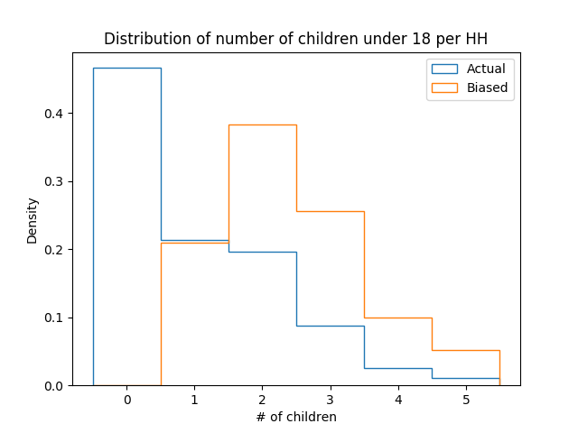

[Think Stats Chapter 3 Exercise 1](http://greenteapress.com/thinkstats2/html/thinkstats2004.html#toc31) (actual vs. biased)

>>   
>> 
>> The actual mean number of children per household is 1.024 and the biased mean is 2.40.
