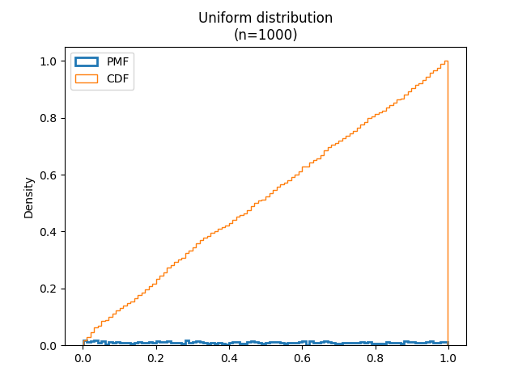

[Think Stats Chapter 4 Exercise 2](http://greenteapress.com/thinkstats2/html/thinkstats2005.html#toc41) (a random distribution)

>> The numbers generated by *random.random* resembles a uniform distribution.   
>>    
>>  
