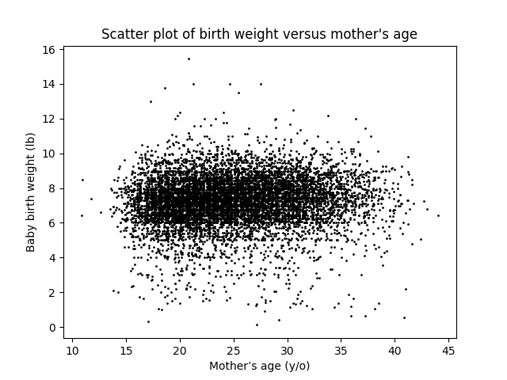
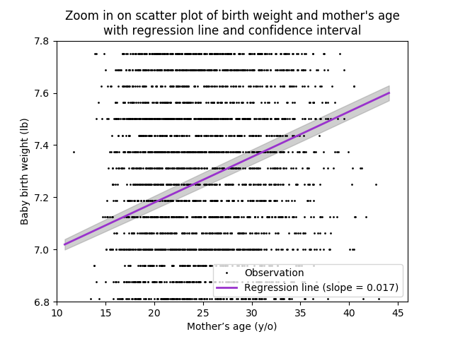
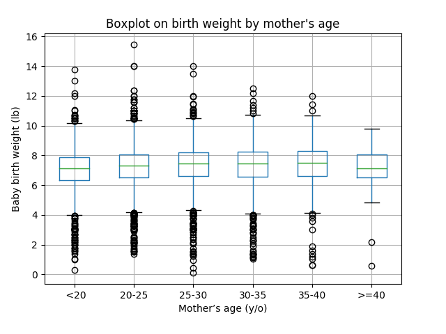

[Think Stats Chapter 7 Exercise 1](http://greenteapress.com/thinkstats2/html/thinkstats2008.html#toc70) (weight vs. age)

>>   
>>   
>>   
>>   
>> The percentiles of birth weight versus mother’s age can be illustrated with the boxplots below:   
>>   
>>    
>>   
>> The Pearson’s correlation between baby birth weight and mother’s age is 0.0688. This number is also represented by the beta coefficient (i.e. slope) in a simple linear regression of birth weight on mother’s age without intercept. The Spearman’s correlation is 0.0946.  
>>    
>> There is a weak positive correlation between baby birth weight and mother’s age (Pearson = 0.0688). When comparing only the rankings, the correlation appears slightly stronger (Spearman’s = 0.0946). However, after adjusting for crude average infant weight in a simple linear regression, the effect of mother’s age on birth weight decreases (est. beta = 0.017). Assuming a linear relationship, a baby is estimated to weight 0.017 pounds more with every one year increase in mother’s age. This effect is mild yet statistically significant (p-value < 0.0001), which is evident through the confidence intervals on the zoomed in scatter plot. Looking at the boxplots, there is a gradual increase in median birth weight from 7.1 to 7.5 lb across mothers from 10 to 30 years old. On the other hand, birth weight starts to fluctuate downwards among mothers nearing 40 years old, but the trend is less clear.
