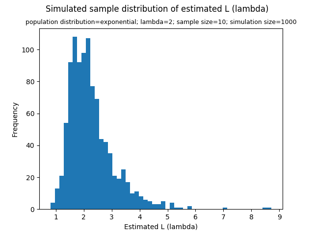
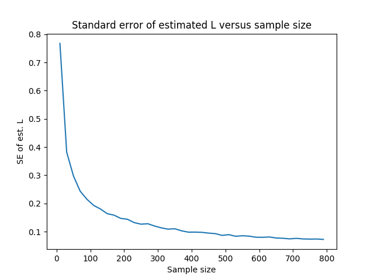

[Think Stats Chapter 8 Exercise 2](http://greenteapress.com/thinkstats2/html/thinkstats2009.html#toc77) (scoring)

>>   
>>   
>> Standard error of estimated L = 0.82  
>> 90% confidence interval of estimated L = [1.28, 3.83]  
>>   
>>   
