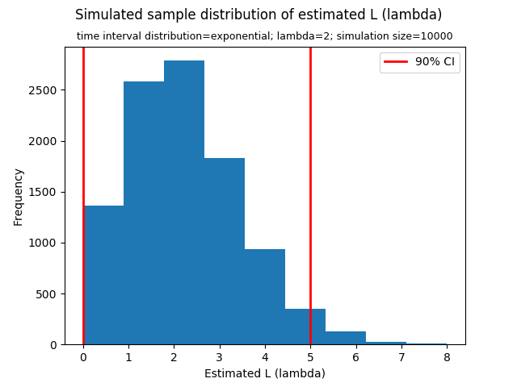

[Think Stats Chapter 8 Exercise 3](http://greenteapress.com/thinkstats2/html/thinkstats2009.html#toc77)

---

>> The two functions are as follows:  
>> ```python  
>> def num_goals(lam):
>>     """
>>     Input: Goal-scoring rate, lam, in goals per game
>>     Goal: Simulates a game by generating the time between goals until the total time exceeds 1 game
>>     Output: Number of goals scored
>>     """
>>     time_lapse = 0
>>     goal = 0
>>     time_lapse += np.random.exponential(scale = 1 / lam, size = 1)
>>     while time_lapse < 1:
>>         goal += 1
>>         time_lapse += np.random.exponential(scale = 1 / lam, size = 1)
>>     return goal
>>   
>> def est_L_with_time(lam, sim):
>>     """
>>     Input: Goal-scoring rate, lam, in goals per game
>>            Number of simulations, sim
>>     Goal: Simulates many games and computes estimated L statistics
>>     Output: (estimated L's, mean error, RMSE, 90% CI)
>>     Note: Use in conjunction with num_goals()
>>     """
>>     L = []
>>     for i in range(sim):
>>         L += [num_goals(lam)]
>>     meanError = (np.array(L) - lam).mean()
>>     RMSE = (((np.array(L) - lam) ** 2).mean()) ** (1/2)
>>     sorted_L = sorted(L)
>>     lower_index = round(0.05 * sim)
>>     upper_index = round(0.95 * sim)
>>     est_90ci = [sorted_L[lower_index], sorted_L[upper_index]]
>>     return (L, meanError, RMSE, est_90ci)
>> ```  
>>   
>> The sampling distribution of the estimates and the 90% confidence interval:  
>>
>>   
>>   
>> Mean error = 0.0138  
>>   
>> RMSE = 1.4037   
>>   
>> 90% confidence interval = [0,5]   
>>    
>> Standard error = 1.4036  
>>   
>> This way of making an estimate is biased. This method works the best when lambda is small and the number of goals approximates a Poisson distribution. In which case, the estimates are highly accurate and this estimation method is recommended. However, when lambda is large, the number of goals approximate a normal distribution, resulting in large estimation errors. In contrast, when lambda is extremely small, the estimate will almost always be zero, which does not yield useful estimates either even though the calculated error may seem small. In addition, this method uses discrete statistics (*number of goals*) to estimate a continuous number (*lambda*); it does not always give the most accurate estimates.

---
